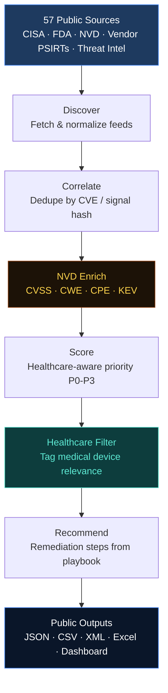

# AdvisoryOps


[](https://travisfunk.github.io/advisoryops-dashboard/)

**Open-source healthcare medical device security intelligence pipeline.**
AdvisoryOps continuously monitors 65 public sources — CISA ICS-Medical, the Known Exploited Vulnerabilities catalog, FDA device recalls, NVD, CERT/CC, vendor PSIRTs, and more — and produces a prioritized, healthcare-aware feed of medical device vulnerabilities. Built for hospital security teams that can't afford commercial platforms like Claroty or TRIMEDX.

---

## What makes this different

1. **Healthcare-focused by design.** The default view is medical device issues, not general IT vulnerabilities. Scoring uses five healthcare-specific dimensions (source authority, device context, patch feasibility, clinical impact, FDA risk class). An FDA Class III cardiac device with no patch available gets a higher priority than a WordPress plugin bug with a patch — that's the point.

2. **Fully open stack.** The data sources are public, the analysis pipeline is open source, the feed outputs are free to consume, and the dashboard is a static HTML file served from GitHub Pages. Most alternatives lock the data, the analysis, or the delivery behind enterprise pricing. AdvisoryOps is Apache 2.0 and free forever.

3. **AI-assisted remediation guidance.** Each high-priority issue gets a recommendation packet: the AI selects from an 11-pattern approved mitigation playbook (VLAN isolation, ACL allowlisting, vendor case tracking, credential hardening, etc.), assigns tasks by role (infosec, netops, HTM/CE, vendor, clinical ops), and cites the underlying standards (NIST SP 800-82, IEC 62443, FDA guidance). Hallucinated patterns are silently filtered. The AI recommends from a curated list — it cannot invent guidance.

---

## Why it exists

Medical device vulnerabilities are chronically under-tracked. Most vulnerability tools treat a pacemaker firmware advisory the same as a WordPress plugin bug. Infusion pumps, ventilators, patient monitors, and imaging systems have unique risk profiles — they sit on clinical networks, they can't always be patched on schedule, and when they fail the consequences are measured in patient safety, not just downtime.

Small and rural hospitals face the same threats as large health systems but with a fraction of the security staff and budget. Commercial medical device security platforms start at six figures per year. Meanwhile, the raw data — CISA advisories, FDA recalls, NVD records, KEV deadlines — is all public. What's missing is the pipeline to pull it together, score it for healthcare relevance, and present it in a way that a two-person security team can act on.

AdvisoryOps closes that gap. The data is free, the analysis is free, the dashboard is free. Apache 2.0 forever.

---

## Live demo

**Dashboard:** [https://travisfunk.github.io/advisoryops-dashboard/](https://travisfunk.github.io/advisoryops-dashboard/)

The "Medical devices" view shows 856 healthcare-relevant issues with CVSS scores, EPSS exploit probabilities, KEV deadlines, FDA risk class badges, and AI-generated remediation guidance with role-split task assignments. Color-coded priority badges (P0-P3), click-to-expand detail panels, and a debounced search bar filtering by title, CVE, vendor, and product. No framework, no build step — single-file vanilla HTML/JS.

---

## Current scope

| Metric | Value |
|--------|-------|
| Total sources monitored | 65 |
| Total issues tracked | 3,929 |
| Medical device issues | 856 |
| Issues with NVD enrichment | 2,362 |
| Issues with KEV required actions | 203 |
| AI recommendation packets | 139 (P0/P1) |
| Automated tests | 1,038 |
| Full corpus rebuild cost | $1.40 |

### Repository structure

The production dashboard lives at `dashboard/index.html` in this repo. The pipeline's `community-build` command copies it to `docs/index.html` along with the generated data files so GitHub Pages can serve it. The dashboard was previously in a separate `advisoryops-dashboard` repo and was consolidated on 2026-04-09 to eliminate cross-repo drift. That repo will be archived after verification.

---

## Quickstart

### Install

```bash
git clone https://github.com/travisfunk/advisoryops
cd advisoryops
pip install -e .
```

### Run the full public pipeline (one command)

```bash
advisoryops community-build --set-id full_public --out-root-community outputs/community_public
```
Outputs: `issues_public.jsonl` · `alerts_public.jsonl` · `feed_latest.json` · `feed_healthcare.json` · `feed.csv` · `feed.xml` · `issues_public.xlsx` · `meta.json`
### Run individual pipeline stages

```bash
# Discover items from a specific source
advisoryops discover --source cisa-icsma --limit 20

# Correlate discovered signals into deduplicated issues
advisoryops correlate --out-root-discover outputs/discover --out-root-correlate outputs/correlate

# Score issues with healthcare-aware priority engine
advisoryops score --in-issues outputs/correlate/issues.jsonl --min-priority P1

# Generate a remediation packet (JSON, Markdown, or CSV) for one issue
advisoryops recommend --issue-id CVE-2024-1234 --format md --out outputs/packets

# Optional: AI-assisted deduplication (OPENAI_API_KEY required)
advisoryops correlate --ai-merge

# Optional: AI healthcare classifier for ambiguous issues
advisoryops score --ai-score

# Run golden fixture evaluation suite
advisoryops evaluate --fixtures tests/fixtures/golden --out outputs/eval
```

---

## Pipeline architecture

```
┌─────────────────────────────────────────────────────────────────┐
│                        DATA SOURCES (57 enabled)                │
│  CISA ICS-Medical · CISA KEV · FDA Recalls · CERT/CC · NVD     │
│  MS MSRC · Cisco · Siemens · Philips · GitHub Security · more  │
└─────────────────────┬───────────────────────────────────────────┘
                      │ RSS/Atom · JSON feeds · CSV feeds
                      ▼
┌─────────────────────────────────────────────────────────────────┐
│  1. DISCOVER  (discover.py + feed_parsers.py)                   │
│  HTTP fetch with retry/backoff → parse → keyword filter         │
│  Track seen GUIDs in state.json for new-item detection          │
│  Normalize all formats into a common signal shape               │
│  Output: outputs/discover/<source>/items.jsonl                  │
└─────────────────────┬───────────────────────────────────────────┘
                      │
                      ▼
┌─────────────────────────────────────────────────────────────────┐
│  2. CORRELATE  (correlate.py + ai_correlate.py)                 │
│  Pass 1 (deterministic): group by CVE ID or title+date hash    │
│  Pass 2 (optional AI): Jaccard similarity + GPT-4o-mini merge  │
│  Output: outputs/correlate/issues.jsonl                         │
└─────────────────────┬───────────────────────────────────────────┘
                      │
                      ▼
┌─────────────────────────────────────────────────────────────────┐
│  3. NVD ENRICH  (nvd_enrich.py)                                 │
│  CVE → CVSS base score, vector, CWE, affected products (CPE)   │
│  KEV cross-reference → required action, due date, ransomware    │
│  1,138 issues enriched in current corpus                        │
│  Output: NVD fields merged into issues.jsonl                    │
└─────────────────────┬───────────────────────────────────────────┘
                      │
                      ▼
┌─────────────────────────────────────────────────────────────────┐
│  4. TAG + SCORE  (tag.py + score.py + ai_score.py)              │
│  Keyword heuristics: exploit, impact, RCE, KEV, ransomware     │
│  Healthcare scoring dimensions:                                 │
│    Source authority · Device context · Patch feasibility         │
│    Clinical impact (patient safety, ICU, PHI)                   │
│  Priority: P0 ≥ 150 · P1 ≥ 100 · P2 ≥ 60 · P3 < 60           │
│  Output: outputs/scored/issues_scored.jsonl + alerts.jsonl      │
└─────────────────────┬───────────────────────────────────────────┘
                      │
                      ▼
┌─────────────────────────────────────────────────────────────────┐
│  5. HEALTHCARE FILTER  (healthcare_filter.py)                   │
│  Tags issues as healthcare-relevant using device keywords,      │
│  ICS-Medical source, FDA recalls, clinical context signals      │
│  234 / 1,990 issues tagged in current corpus                    │
│  Output: feed_healthcare.json                                   │
└─────────────────────┬───────────────────────────────────────────┘
                      │
                      ▼
┌─────────────────────────────────────────────────────────────────┐
│  6. RECOMMEND  (recommend.py + playbook.py + packet_export.py)  │
│  AI selects from approved mitigation playbook patterns          │
│  Role-split tasks: infosec / netops / htm_ce / vendor / clinical│
│  Exports: JSON packet · Markdown report · CSV for ticket import │
│  Output: outputs/packets/<issue>_packet.{json,md,csv}           │
└─────────────────────────────────────────────────────────────────┘
```

### Key design choices

| Choice | Rationale |
|--------|-----------|
| **Feeds only, no scraping** | RSS/JSON/CSV feeds are reliable, legal, and don't break on DOM changes |
| **Deterministic first, AI second** | Group by CVE ID before calling any AI — keeps cost near zero for routine runs |
| **NVD enrichment + KEV cross-ref** | CVSS scores, CWE IDs, and KEV deadlines added automatically for every CVE |
| **Healthcare relevance filter** | Separates medical device issues from general IT vulnerabilities |
| **Playbook-constrained recommendations** | AI selects from an approved pattern list; hallucinated IDs are silently dropped |
| **On-disk AI response cache** | SHA-256 keyed; same issue never costs twice across runs |
| **JSONL everywhere** | Line-delimited JSON is git-diffable, stream-processable, and appendable |

---

## Source coverage

**65 enabled sources across 7 categories**

| Category | Count | Examples |
|----------|-------|---------|
| CISA / US-CERT | 8 | ICS-Medical, ICS advisories, KEV (JSON + CSV), AA alerts, CERT/CC |
| FDA | 3 | MAUDE device events, device recalls, MedWatch |
| NVD / NIST | 2 | NVD recent CVEs, NVD modified CVEs feed |
| Vendor PSIRTs | 10 | Microsoft MSRC, Cisco PSIRT, Siemens ProductCERT, Philips, BD, Medtronic, Abbott |
| Threat Intelligence | 8 | AlienVault OTX, GitHub Security Advisories, EPSS, abuse.ch |
| Security News | 14 | Krebs on Security, BleepingComputer, Dark Reading, SANS ISC, SecurityWeek |
| Healthcare Orgs | 6 | H-ISAC, HHS 405(d), AHA, HSCC, FDA Safety Communications |

To add a new source, add a record to `configs/sources.json` (page_type must be `rss_atom`, `json_feed`, or `csv_feed`) and run:

```bash
python scripts/smoke_test_all_sources.py
```

---

## Running tests

```bash
# Full suite — no API key required (all AI calls use injectable mocks)
python -m pytest            # 1038 tests

# Specific modules
python -m pytest tests/test_score_healthcare.py -v
python -m pytest tests/test_healthcare_filter.py -v
python -m pytest tests/test_nvd_enrich.py -v
python -m pytest tests/test_community_build.py -v
```

---

## Trust & provenance

Every AI-generated output carries an evidence trail:

- **Remediation recommendations** cite the specific advisory evidence that triggered each pattern selection, reference the standard behind the pattern (NIST SP 800-82, IEC 62443, FDA pre/postmarket guidance, CISA ICS-CERT best practices), and include a disclaimer requiring verification against vendor documentation before implementation.
- **Cross-source contradiction detection** compares severity, CVE lists, and patch status across contributing sources, surfacing where sources agree and diverge.
- **NVD enrichment** adds authoritative CVSS scores, CWE IDs, and KEV required actions with due dates — drawn directly from NIST and CISA data.
- A `generated_by` label on every output (`ai`, `deterministic`, or `hybrid`) makes clear what was extracted from source text versus inferred by a model.

> **Important:** The AI extracts, normalizes, compares, and recommends from approved mitigation patterns. It does not replace vendor guidance or make final operational decisions. All recommendations must be verified against vendor documentation and validated by qualified personnel before implementation in clinical environments.

---

## Documentation

- **[Architecture diagram](docs/architecture.md)** — data flow from 65 sources through ingestion, correlation, enrichment, AI processing, and out to consumers
- **[Scoring internals](docs/scoring_internals.md)** — how the v2 healthcare-aware scoring works (5 dimensions, score ranges, priority thresholds)
- **[Feed schema](docs/schema.md)** — every field in the feed output with types and descriptions
- **[Feed contract](docs/feed_contract.json)** — schema contract between the pipeline and the dashboard, enforced by tests
- **[Playbook governance](docs/playbook_governance.md)** — how mitigation patterns are reviewed, approved, and cited
- **[KEV analysis](docs/kev_medical_device_analysis.md)** — why CISA KEV has zero medical device overlap (and why that matters)
- **[Session state](docs/session_state.md)** — internal project context for contributors (problems, architecture decisions, session history)

---

## Contributing

1. **Fork** the repo and create a feature branch (`git checkout -b feat/my-source`)
2. **Write tests first** — every new function needs at least one pytest test
3. **Feeds only** — new sources must use `rss_atom`, `json_feed`, or `csv_feed` page_type
4. **Run the full suite** before opening a PR: `python -m pytest -q`
5. **For new sources**: add to `configs/sources.json`, smoke-test, document in your PR

For bugs, open a GitHub issue with: steps to reproduce, Python version, and the relevant `outputs/*/meta.json` if applicable.

---

## License

Copyright 2026 Travis Funk and contributors.
Licensed under the **Apache License, Version 2.0** — see [LICENSE](LICENSE) for the full text.

Data sourced from CISA, FDA, NVD/NIST, and other US government publications is in the public domain and not subject to copyright.
