# AdvisoryOps Architecture

This diagram shows the data flow from public sources through ingestion,
correlation, enrichment, AI processing, and out to consumers.

```mermaid
graph TB
    subgraph Sources["Public Sources (65)"]
        S1[CISA ICS-Medical]
        S2[FDA Recalls<br/>openFDA]
        S3[NVD]
        S4[KEV Catalog]
        S5[Vendor PSIRTs<br/>Philips, Siemens]
        S6[Threat Intel<br/>URLhaus, Feodo]
        S7[Other 58 sources]
    end

    subgraph Ingestion["Ingestion Layer"]
        I1[Per-source<br/>connectors]
        I2[Historical<br/>backfill]
        I3[Cache layer<br/>340K NVD records]
    end

    subgraph Correlation["Correlation"]
        C1[CVE-based<br/>merging]
        C2[Title+date<br/>UNK grouping<br/>+ source_id]
    end

    subgraph Enrichment["Enrichment Layer"]
        E1[NVD CVSS/CWE]
        E2[FDA Risk Class]
        E3[EPSS scores<br/>325K cached]
        E4[KEV cross-ref]
        E5[Vulnrichment]
    end

    subgraph AI["AI Layer (gpt-4o-mini)"]
        A1[Plain-language<br/>summaries]
        A2[Source-cited<br/>mitigations]
        A3[Field<br/>extraction]
        A4[AI scoring]
        A5[Recommendation<br/>packets<br/>11-pattern playbook]
    end

    subgraph Scoring["Healthcare-Aware Scoring v2"]
        SC1[Source authority]
        SC2[Device context]
        SC3[Patch feasibility]
        SC4[Clinical impact]
        SC5[FDA risk class]
    end

    subgraph Outputs["Outputs"]
        O1[feed_latest.json]
        O2[feed_healthcare.json]
        O3[Per-issue<br/>packet JSON]
        O4[Excel export]
        O5[RSS feeds]
        O6[Sanity report]
    end

    subgraph Consumers["Consumers"]
        D1[Public dashboard<br/>GitHub Pages]
        D2[API consumers]
        D3[Hospital security<br/>teams]
    end

    Sources --> Ingestion
    Ingestion --> Correlation
    Correlation --> Enrichment
    Enrichment --> AI
    AI --> Scoring
    Scoring --> Outputs
    Outputs --> Consumers
```

## Layer descriptions

### Ingestion
Each source has a per-source connector that handles its specific format (RSS, JSON API, CSV feed). All connectors write into a normalized signal format. Historical backfill modules can fetch years of data on demand. Persistent caches across runs keep API calls minimal — full corpus rebuild costs ~$1.40, weekly incremental updates near-zero.

### Correlation
Signals are grouped into issues. CVE-based signals merge by CVE ID. Non-CVE signals merge by `(source_id, normalized_title, published_date)` — including source_id prevents cross-source collisions where different feeds with placeholder titles would otherwise merge incorrectly.

### Enrichment
Multiple parallel enrichment passes add structured metadata: NVD provides CVSS scores and CWE IDs; FDA classification provides device risk class; EPSS provides exploit probability; KEV provides "actively exploited" flags and required actions. All enrichment is cached.

### AI Layer
The AI layer is gated behind explicit CLI flags so the pipeline can run deterministically without AI when needed. When enabled, gpt-4o-mini generates plain-language summaries, extracts source-cited mitigations from advisory text, extracts structured fields (vendor, product, severity) from rewritten summaries, performs second-opinion scoring, and generates per-issue recommendation packets selecting from an 11-pattern approved mitigation playbook with role-split task assignments (infosec, netops, HTM/CE, vendor, clinical_ops, IT_ops).

### Scoring
The v2 healthcare-aware scoring adds five healthcare-specific dimensions on top of a v1 keyword baseline: source authority (CISA ICS-Medical weighted higher), device context (infusion pump > general IT), patch feasibility (no-patch raises priority), clinical impact (life-sustaining > admin systems), and FDA risk class (Class III > Class II > Class I).

### Outputs
The pipeline writes a public feed (all issues), a healthcare-filtered feed, per-issue JSON packets with full AI guidance, an Excel export for hospital procurement workflows, RSS feeds for various priority slices, and a sanity report surfacing aggregate health checks (correlation collisions, field completeness, AI coverage).

### Consumers
The public dashboard at GitHub Pages serves the data files directly to any browser. API consumers can pull feed JSON. Hospital security teams use the dashboard for triage and the Excel export for procurement workflow integration.
